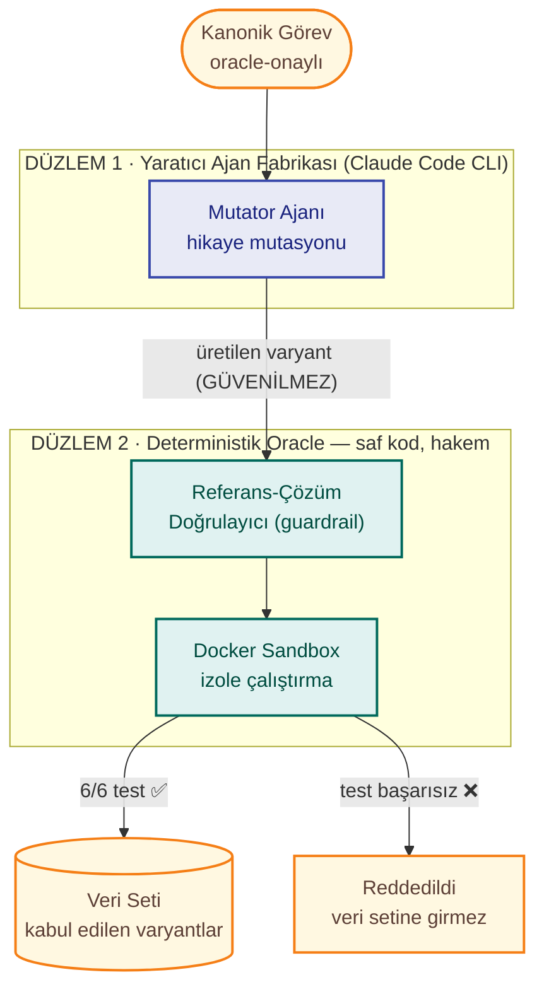
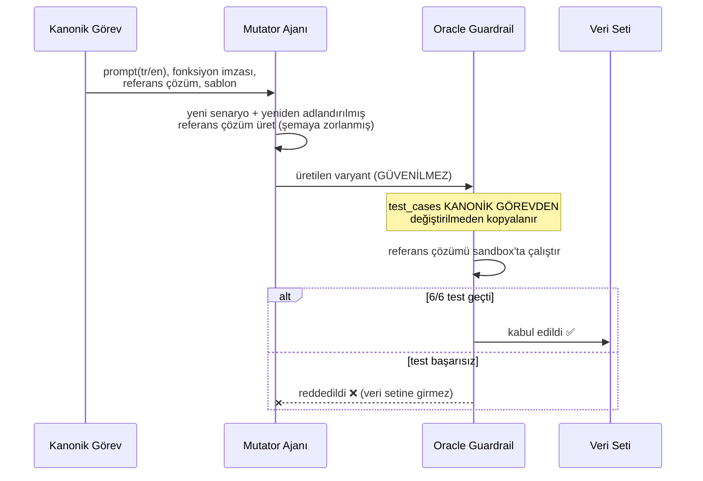

# TR-CodeEval

### Türkçe, Çalıştırma-Tabanlı, Kirlilik-Dirençli Bir Kod-Anlama Değerlendirme Takımı

Bu proje, yerel (açık kaynak, küçük ölçekli) dil modellerinin kod
problemlerini *gerçekten anlayıp anlamadığını* ölçen, yeniden kullanılabilir
bir **değerlendirme takımı (benchmark)** inşa eder. Katkı bir model eğitmek
ya da çalıştırmak değildir; herkesin kendi modelini geçirebileceği, güvenilir
bir **ölçü aleti** kurmaktır — tıpkı MMLU veya HumanEval'in tanınırlığının
belirli bir modelden değil, iyi tasarlanmış bir ölçüm standardından gelmesi
gibi.

---

## Katkılar

1. **Türkçe'ye özgü, çalıştırma-tabanlı kod-anlama ölçümü.** Çoktan seçmeli
   değil; model gerçek Python kodu üretir, kod gerçek testlerle çalıştırılır.
2. **İki-düzlemli mimari.** Üretken bir dil modeli hiçbir zaman hakem
   değildir; her üretim, deterministik bir doğrulama kapısından (guardrail)
   geçmeden veri setine giremez.
3. **Yeniden kullanılabilir, API-anahtarsız bir "ajan fabrikası" altyapısı.**
   Tüm yaratıcı ajanlar (Mutator, ileride Translator/Test-Öneri/Failure-
   Classifier) tek bir genel ilkel (`ajan_cagir`) üzerinden çalışır.
4. **"İki benchmark, tek altyapı" çerçevesi.** Aynı koşum matrisinden hem
   saf kodlama yeteneği (İngilizce) hem Türkçe muhakeme vergisi ölçülür.
5. **Şeffaf metodoloji.** Ölçüm gürültüsü (GPU determinizmsizliği, küçük
   örneklem) gizlenmez; açıkça raporlanır ve nicel olarak sınırları çizilir.

---

## İçindekiler

- [İki Benchmark, Tek Altyapı](#i̇ki-benchmark-tek-altyapı)
- [Mimari — İki Düzlem](#mimari--i̇ki-düzlem)
- [Ajan Mimarisi](#ajan-mimarisi)
- [Bir Görevin Yaşam Döngüsü](#bir-görevin-yaşam-döngüsü)
- [Kurulum](#kurulum)
- [Kullanım](#kullanım)
- [Ölçülen Metrikler](#ölçülen-metrikler)
- [Metodolojik Dürüstlük ve Bilinen Sınırlılıklar](#metodolojik-dürüstlük-ve-bilinen-sınırlılıklar)
- [Proje Yapısı](#proje-yapısı)
- [İki Track Hakkında](#i̇ki-track-hakkında)
- [Donanım Notu](#donanım-notu)

> **Durum (Gün 13/20):** Deterministik çekirdek (Docker sandbox + oracle),
> yerel model istemcisi, çok-modelli koşum matrisi ve Mutator ajanı (Düzlem
> 1'in ilk fiili ajanı) çalışıyor ve testli. Veri seti 27 görev (20 kanonik +
> 7 mutasyon varyantı), 58 test. Detaylı ilerleme:
> [`docs/20_gunluk_plani.md`](docs/20_gunluk_plani.md); günlük gelişim kaydı:
> [`docs/staj_defteri_gunlukleri.md`](docs/staj_defteri_gunlukleri.md);
> tam mimari gerekçe: [`docs/proje_yon_raporu.md`](docs/proje_yon_raporu.md).

---

## İki Benchmark, Tek Altyapı

Proje geliştikçe, aynı ölçüm altyapısından **iki ayrı ama birbirini
tamamlayan araştırma sorusunun** cevaplanabileceği netleşti.

| | Benchmark A — Saf Kodlama Yeteneği | Benchmark B — Türkçe Muhakeme Vergisi |
|---|---|---|
| **Soru** | Küçük modeller (0.5B–3B) kodlamada ne kadar başarılı? | Aynı problem Türkçe sorulunca başarı ne kadar düşüyor? |
| **Ölçüm dili** | **İngilizce** (bilinçli tercih — aşağıya bakınız) | Türkçe **vs.** İngilizce (fark alınır) |
| **Ana metrik** | `acc(en)`, ölçek trendi (0.5B→3B eğrisi) | `acc(en) − acc(tr)` |
| **Neden ayrı?** | Dil engelinden arındırılmış "saf yetenek" sinyali | B'yi yorumlamak, A'nın temiz tabanını gerektirir |

**Neden İngilizce?** Test edilen modellerin eğitim verisinde baskın dil
İngilizce'dir; bu yüzden İngilizce, modelin kodlama/akıl yürütme yeteneğini
en az bulanıklaştıran ölçüm ortamıdır. Türkçe ile ölçülen tek bir sayı, iki
farklı zayıflığı (kodlama zayıflığı + dil zayıflığı) birbirine karıştırır —
`acc(en)` bu karışımı ayrıştırır.

İki benchmark de **aynı koşum matrisinden** çıkar (`run_matrix.py`, her görev
× her model için hem `tr` hem `en` koşulur); ek bir altyapı gerekmez, yalnızca
sonuçlar iki ayrı bulgu olarak raporlanır.

Var olan kod benchmark'larından ayrıca üç eksende farklılaşılır: **(1)
Türkçe** (yukarıdaki B), **(2) ezber-dayanıklılığı** (aynı problemin
yeniden-yazılmış/mutasyona uğramış versiyonunda başarı düşüyorsa, bu anlama
değil ezber işaretidir), **(3) çalıştırma-tabanlı gerçek doğrulama** (karar
hiçbir zaman bir LLM'den değil, gerçek kod çalıştırmasından gelir).

---

## Mimari — İki Düzlem

Benchmark'ların en büyük riski, ölçümün kendisinin güvenilir olmamasıdır —
testleri veya doğru cevabı bir LLM üretiyorsa "doğru" tanımı kayar ve
sonuçlar bilimsel olarak anlamsızlaşır. Bu riski kökten kapatmak için proje
iki düzleme ayrılır ve bu ikisi **birbirine karışmaz**:



**Doğrulama kapısı (guardrail).** Düzlem 1'in ürettiği bir varyant, kendi
referans çözümü kendi test durumlarını Sandbox'ta eksiksiz geçmeden veri
setine yazılmaz. Bu kural, elle yazılan görevlere de aynı titizlikle
uygulanır — istisnasız.

Test edilen yerel modeller (Ollama/LM Studio üzerinden) bu şemada **özne**dir,
hakem değil: ürettikleri kodun kararını yalnızca Düzlem 2 verir.

---

## Ajan Mimarisi

Düzlem 1'in özünde tek bir yeniden kullanılabilir ilke yatar:

> **persona** (ajan kim, sınırları ne) + **göreve özel içerik** (ne
> üretecek) + **zorunlu çıktı şeması** (nasıl cevap verecek) →
> doğrulanabilir, yapılandırılmış veri.

Bu ilke `src/agent_factory/client.py` içinde TEK bir fonksiyona indirgenir:

```python
def ajan_cagir(persona: str, gorev_metni: str, json_semasi: dict) -> dict:
    """Persona (sistem promptu, SABİT) + göreve özel metin (değişken)
    -> JSON Schema'ya zorlanmış, doğrulanmış çıktı."""
```

Bu fonksiyon, kurulu **Claude Code CLI**'yi headless modda (`-p`),
`--system-prompt` ve `--json-schema` bayraklarıyla çağırır. Ham bir API
istemcisi yazmak yerine bu yaklaşımın seçilmesinin iki somut mühendislik
gerekçesi vardır:

1. **Şema zorlaması, ayrıştırma riskini sıfırlar.** Düzlem 2'nin test ettiği
   yerel modellerin çıktısı markdown kod bloğundan regex ile ayıklanır
   (`model_client/code_task.py: kod_ayikla`) — küçük modeller katı JSON
   biçimine güvenilir uyamadığı için. Fabrika ajanında bu riske hiç gerek
   yoktur: `--json-schema`, çıktının şemaya uymasını **garanti** eder.
2. **Sabit persona, ölçülebilir bir maliyet avantajı sağlar.** Persona metni
   her çağrıda birebir aynı tutulur (göreve özel içerik ayrı gönderilir);
   bu, Anthropic'in prompt önbelleklemesini tetikler. Ölçülen sonuç: ilk
   çağrı $0.22 → personayı ayırınca $0.16 → önbellek isabetiyle $0.043
   (bkz. `docs/staj_defteri_gunlukleri.md`, Gün 13). Ayrı bir
   `ANTHROPIC_API_KEY` gerekmez — mevcut Claude Code girişi kullanılır.

Bu tek fonksiyon hâlihazırda **Mutator** ajanı tarafından kullanılıyor
(`src/agent_factory/mutator.py`); Gün 14'teki **Translator** ve ileride
eklenecek Test-Öneri/Failure-Classifier ajanları da AYNI fonksiyonu
kullanacak — her yeni ajan yalnızca kendi persona metnini ve JSON şemasını
tanımlamakla yükümlüdür, alt katmana dokunmaz.

**Guardrail döngüsü, Mutator özelinde:**



**Tasarım kararı — Mutator'ın kapsamı bilinçli olarak dar tutuldu:** ajan
yalnızca senaryoyu (bağlamı) ve isimleri değiştirir; `test_cases`'e hiç
erişimi yoktur, sayısal davranışı asla göremez. Böylece riski tek bir noktaya
indirgenir (isim değişikliği sırasında mantığı bozma), ve bu risk doğrudan
guardrail tarafından mekanik olarak test edilir.

**Doğrulanmış güvenilirlik.** Bu mimari kalıcı koda dökülmeden önce, persona
7 farklı pilot senaryoda (özyinelemeli fonksiyonlar, çok-parametreli
fonksiyonlar, ince/kalın bağlam şablonları) sınandı — 7/7 pilot oracle'dan
tam puan aldı, kod-düzeyinde satır satır karşılaştırmada hiçbir mantık
sapması bulunmadı. Üretim koduna geçildikten sonra 7 gerçek varyant
(`trc_021`–`trc_027`) aynı disiplinle üretilip veri setine eklendi.

---

## Bir Görevin Yaşam Döngüsü

Kod okumadan da anlaşılabilmesi için, tek bir görevin uçtan uca nasıl
işlendiği:

1. **Görev tanımı** — bir JSON dosyası: Türkçe/İngilizce problem metni,
   beklenen fonksiyon imzası, bir *referans çözüm* (doğru kod) ve gizli test
   durumları.
2. **Doğrulama (oracle)** — görev, veri setine girmeden önce kendi referans
   çözümü kendi testlerinde çalıştırılır. Geçmezse görev geçersiz sayılır.
3. **Model koşumu** — aynı problem, test edilen yerel modele hem Türkçe hem
   İngilizce sorulur; model bir Python fonksiyonu üretir.
4. **Sandbox değerlendirmesi** — üretilen kod, ağsız/izole bir Docker
   konteynerinde çalıştırılıp gizli testlerle karşılaştırılır. Sonuç:
   geçti/kaldı, kaç test geçti, hangi hata türü (varsa).
5. **(Opsiyonel) Varyant üretimi** — Mutator ajanı, aynı görevi yeni bir
   senaryoyla (örn. "market" yerine "kütüphane") yeniden yazar; bu varyant
   da adım 2'deki aynı doğrulamadan geçmeden veri setine giremez.
6. **Toplama ve raporlama** — birçok görev × model × dil sonucundan
   `acc(en)`, `acc(tr)`, Türkçe vergisi ve diğer metrikler hesaplanır.

---

## Kurulum

```bash
# 1) İzole, tekrarlanabilir Python ortamı
python -m venv .venv && source .venv/bin/activate
pip install -r requirements.txt

# 2) Sandbox temel imajını derle (bir kez)
docker build -t trc-sandbox:latest src/sandbox

# 3) Yerel model sunucusu (test edilen özneler) — Ollama örneği
ollama serve &
ollama pull qwen2.5:1.5b        # 4 GB VRAM'e uygun küçük modeller

# 4) Mutator ajanı için Claude Code CLI (Düzlem 1 — opsiyonel, yalnızca
#    veri seti büyütmek/varyant üretmek için gerekir; ham koşum/oracle için
#    gerekmez). Ayrı bir ANTHROPIC_API_KEY GEREKTİRMEZ — mevcut Claude Code
#    girişini (Pro/Max abonelik) kullanır. npm global izin hatası alırsan
#    önce `npm config set prefix ~/.npm-global` ile kullanıcı dizinine al.
npm install -g @anthropic-ai/claude-code
claude login
```

## Kullanım

```bash
# Sandbox + oracle self-test (model gerektirmez)
python src/sandbox/executor.py
python src/oracle/task_validator.py

# Tek görev, uçtan uca: görev -> model -> sandbox -> pass/fail
python src/run_task.py --model qwen2.5:1.5b --dil tr

# Çoklu-model matris (Benchmark A + B'nin ham verisi — her hücre hem tr hem en):
python src/run_matrix.py --tekrar 3                       # sicaklik=0: kararlılık
python src/run_matrix.py --tekrar 5 --sicaklik 0.4        # gerçek pass@k

# Mutator: kanonik görevden hikaye-mutasyonu varyantı üret (Claude Code CLI gerekir).
# Her varyant, dosyaya yazılmadan önce oracle guardrail'inden geçmek ZORUNDADIR.
python src/run_mutator.py --gorev data/tasks/trc_003.json --sayi 2

# Testler (birim + Docker entegrasyon; agent_factory testleri claude CLI gerektirmez, mock'lu)
python -m pytest -v
```

---

## Ölçülen Metrikler

| Metrik | Tanım | Kaynak |
|---|---|---|
| **pass@1 / pass@k** | Modelin bir görevi ilk denemede (pass@1) ya da k denemeden en az birinde (pass@k) doğru çözme oranı | Chen ve ark., 2021 (HumanEval/Codex) — alanın standart ölçütü |
| **Türkçe muhakeme vergisi** | `acc(en) − acc(tr)` | Benchmark B'nin ana bulgusu |
| **Ezber farkı** | `acc(orijinal) − acc(mutasyon)` — düşüş varsa ezber/kirlilik işareti | Veri girdisi Gün 13'ten itibaren mevcut (Mutator varyantları); hesaplama Gün 15 |
| **Token vergisi** | `tokens(tr) / tokens(en)` | Türkçe'nin maliyet/gecikme etkisi |

---

## Metodolojik Dürüstlük ve Bilinen Sınırlılıklar

Bir ölçüm aracının güvenilirliği, güçlü yanlarını değil sınırlarını ne kadar
açık söylediğiyle ölçülür. Bu bölüm bilerek buraya, en görünür yere konmuştur.

**Veri seti ölçeği — en önemli sınırlılık.**
Şu an 27 görev var; hedef ~150–200 değerlendirme birimi
(`docs/proje_yon_raporu.md` §5). Bir oran tahmininin standart hatası
`√(p(1−p)/n)` olduğundan, n=27'de %95 güven aralığı kabaca **±20 puan**
genişliğindedir — iki model arasındaki küçük/orta farklar bu ölçekte
istatistiksel olarak ayırt edilemez. Mevcut sonuçlar bu yüzden öncü/keşifsel
(pilot) bulgular olarak okunmalı, kesin iddialar olarak değil. Veri seti Gün
14 sonrasında büyütülmeye devam edecek.

**Determinizm — hakem ile özne farklıdır.**
Değerlendirme hakemi (Düzlem 2: Sandbox + Oracle) tamamen deterministiktir ve
testlidir (41+ birim/entegrasyon testi). Test edilen özne (yerel model,
düşük VRAM'de GPU offload ile) sabit `seed`'de bile bit-tekrarlanabilir
DEĞİLDİR — bu, hakemin eksikliği değil, ölçülen sistemin doğal bir
özelliğidir. Bu yüzden `run_matrix` her hücreyi K kez örnekler; `sicaklik=0`
'da anlamlı olan **kararlılık**tır, yalnızca `sicaklik>0`'da gerçek
**pass@k** hesaplanır. İkisi hiçbir yerde karıştırılmaz.

**Orkestrasyon — LangGraph bilinçli olarak kullanılmıyor.**
İlk planda bileşenleri bağlamak için LangGraph düşünülmüştü. Ajan zinciri şu
an büyük ölçüde doğrusaldır (Görev → Mutator → Guardrail → [Translator, Gün
14]) ve tek bir koşullu dal içerir — bu, düz bir Python fonksiyon zinciriyle
(`src/agent_factory/client.py`, yukarıya bakınız) tam olarak çözülmektedir.
Grafik tabanlı bir orkestrasyon kütüphanesi eklemek, henüz karşılığı olmayan
bir bağımlılık (aşırı mühendislik) olurdu; bu yüzden askıya alındı. Gerçek
ihtiyaç doğarsa (çoklu ajan arası döngüsel/koşullu yönlendirme) yeniden
değerlendirilecek.

---

## Proje Yapısı

```
src/
  sandbox/        Docker sandbox: Dockerfile, harness (container-içi), executor (host)
  oracle/         Referans-çözüm doğrulayıcı (guardrail)
  model_client/   Ollama/LM Studio istemcisi + kod prompt/ayıklama (Düzlem 2 — test edilen özneler)
  agent_factory/  Claude Code CLI çağırıcı + Mutator ajanı (Düzlem 1 — yaratıcı ajan fabrikası)
  run_task.py     Tek görev dikey dilim
  run_matrix.py   Çoklu-model × dil koşum matrisi (JSON + CSV) — Benchmark A+B'nin ham verisi
  run_mutator.py  Mutator ile kanonik görevden varyant üretimi
  prompt_builder.py   [Faz 1 arşivi — aşağıya bakınız]
data/tasks/       Kanonik + mutasyon kod görevleri (trc_*.json, kaynak alanıyla ayrılır)
tests/            Birim + Docker/agent entegrasyon testleri (pytest)
docs/             Yön raporu, 20 günlük plan, staj defteri
results/          Koşum çıktıları (JSON/CSV)
```

---

## İki Track Hakkında

Bu depo iki iz taşır:

1. **Kod-değerlendirme (asıl proje).** Yukarıda anlatılan her şey.
   `data/tasks/`, `src/sandbox|oracle|model_client|agent_factory`, `run_task`,
   `run_matrix`, `run_mutator`.
2. **Çoktan-seçmeli (Faz 1 öğrenme arşivi).** `data/sample_questions.json` ve
   `src/prompt_builder.py`, stajın ilk günlerinde (Gün 5-6) değerlendirme
   mantığını öğrenmek için yazıldı. Asıl kod-değerlendirme hattı bunları
   kullanmaz; öğrenme kaydı olarak korunur, silinmez.

---

## Donanım Notu

Geliştirme makinesi 4 GB VRAM'lidir; kurumsal büyük modeller test edilmez.
Bunun yerine aynı ailenin farklı boyları (0.5B→3B) ile **ölçek trendi**
çıkarılır — laptopla üretilen ama büyük modeller hakkında da söz söyleyen
dürüst bir yaklaşım.
